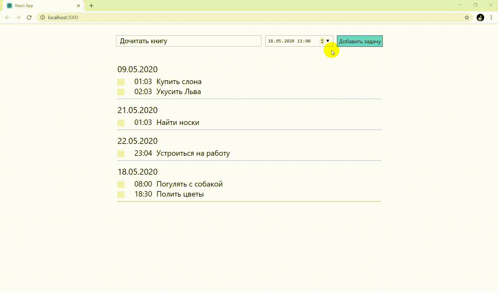

# Менеджер задач
Тестовое задание для VisionLabs.
To-Do List с группировкой задач по датам и сортировкой по времени и выполнению.

## Как запустить:

``npm i``

``npm start``

## MVP функционал:

- Добавление задач
- Сортировка внутри одной даты по времени
- Все выполненные задачи попадают в конец своей даты

## Технологии

**React, Redux, CSS, HTML Webpack, Babel.**

## Авторы

- [Владислава Кетурка](https://github.com/LevVPaname)
